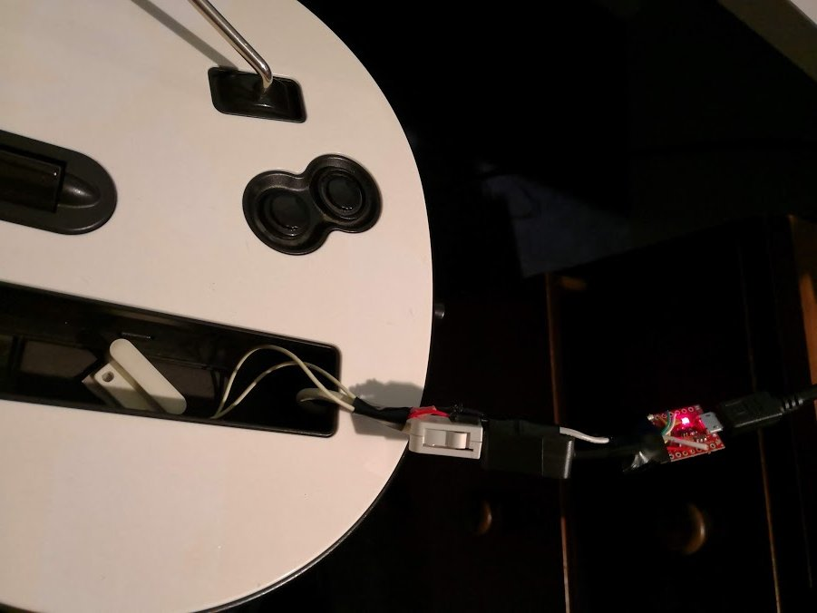
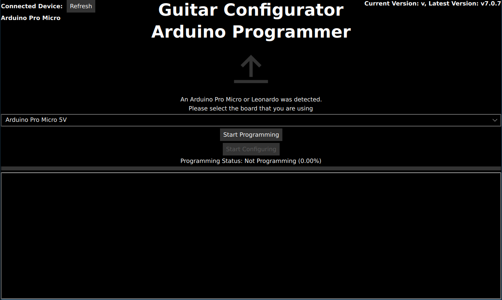
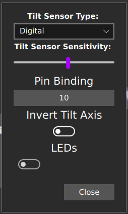

# Building an Adaptor for a Wii Controller
## You will need
* One of the following Arduinos
  * Pi Pico
  * Arduino Pro Micro (3.3v)
  * Arduino Pro Micro (5v) and a 3.3v voltage regulator (note that some breakout boards will come with this, such as the one linked below.)
  * Arduino Leonardo
  * Arduino Micro
  * Arduino Uno
  * Arduino Mega
* Some sort of tilt sensor (if you want tilt) out of the following list:
  * A basic tilt switch (sometimes called a Mercury or Gravity switch). It is recommended to use two, as this can help avoid accidental activations (this is what is done in some offical guitars) (I recommend this over the MPU-6050 as it has less issues.)
  * [MPU 6050](https://invensense.tdk.com/products/motion-tracking/6-axis/mpu-6050/)
  * An analogue accelerometer, such as the [ADXL3xx](https://www.arduino.cc/en/Tutorial/ADXL3xx)
* A Wii extension breakout board or an extension cable, such as [this](https://www.adafruit.com/product/4836). You can also choose to cut the end of the extension and solder your own cables on as well if you perfer.
* Some Wire
* A Soldering Iron

```note
If you are unsure what microcontroller you want to use, click [here](https://sanjay900.github.io/guitar-configurator/guides/micro-controller-comparison.html) for a list of pros and cons about each microcontroller.
```

```danger
Be careful that you don't ever provide 5v power to the power pin of a Wii Extension, as they are not designed for this. The data pins however are tolerant of 5v, so you can hook these up directly to pins on your Arduino.
```

```danger
Note that there are currently some issues with 5tar wiitars. However, these have latency issues anyways when used with wii adapters, so for these it makes more sense to [directly](https://sanjay900.github.io/guitar-configurator/guides/direct.html) wire them. I am currently waiting for a 5tar to arrive, once it does I will be able to fix this issue.
```

```danger
Be careful when programming an Arduino that has multiple variants. If you pick the wrong voltage, your device won't show up and you will need to follow the [rescuing](https://sanjay900.github.io/guitar-configurator/tool/rescuing.html) instructions to make it show up again!
```

## The finished product


## Steps
1. Connect wires between the SDA and SCL pins on your breakout board / wii extension cable. 
Refer to the following image for the pinout of a Wii Extension connector.

    
   * For a Pi Pico, the SDA pin is pin 18 and the SCL pin is pin 19.
   * For an Arduino Pro Micro (3.3v), Leonardo or Micro, the SDA pin is pin 2 and the SCL pin is pin 3.
   * For an Arduino Uno, pin A4 is SDA and A5 is SCL. Note that on newer arduinos, these pins are also available at the top of the board and are labeled SDA and SCL, but note that these are the same pins, so you can use either.
   * For an Arduino Mega, pin 20 is SDA and pin 21 is SCL.
2. Connect the 3.3v pin on the wii breakout / extension cable to the 3.3v pin on your Arduino. For the 5v Pro Micro, you will need to hook a 3.3v voltage regulator to the Arduino first, and then connect the 3.3v output of the regulator to the wii breakout.
3. Connect the gnd pin on the wii breakout / extension cable to the gnd on your Arduino.
4. Connect your tilt sensor
   * If you are using a basic tilt switch, connect two switches in series between ground and any digital pin that has not already been used.
     * If you want to add LEDs to your guitar, avoid the MISO, MOSI and SCK pins on your Arduino.
       * For an Arduino Pro Micro (3.3v), Leonardo or Micro, the SCK pin is pin 15, the MOSI pin is pin 16 and the MISO pin is pin 14.
       * For an Arduino Uno, pin 11 is MOSI, pin 12 is MISO and pin 13 is SCK.
   * If you are using a MPU 6050, connect its SCL and SDA pins to the same pins as above. Also connect its GND pin to GND on your arduino and its VCC pin to VCC on your arduino. 
   * If you are using an analogue tilt sensor, hook the x y and z pins up to any of the analogue pins on your Arduino. Note that when using an Arduino uno, you cannot use pins A4 or A5.
5. Start the Ardwiino Configuration Tool
6. Plug in your Arduino
7. Your Arduino should show up, like in the following image.

    

8. Click Continue
9. You will be met with the following screen (Note that it will be slightly different for an Arduino Uno or Arduino Mega)

    

10. For the Micro, Leonardo and Pro Micro, please pick the type of device you have in the dropdown. Note that you need to get the voltage right, otherwise your device will not work and will need to be reset.
11. Click `Start programming` and wait for it to program
12. Once it finishes, Click `Start Configuring`
13. You will be taken to following the configuration screen.

    

14. Click on `Change Device Settings`.
15. You will be shown the following dialog:

    

16. Change `Controller Connectivity Type` to Wii.
17. You can also change the `Controller Output Type` here too if you would like to emulate a different type of controller, such as a drum set, a standard controller or even a controller for a different console, like a PS3 or a Switch.
18. If you would like the Left Joystick (The only Joystick on a Wii Guitar) to act like the DPad, then enable `Map Left Joystick to DPad`
19. If you would like to emulate the Home button by hitting both Start and Select at the same time, then enable `Map Start + Select to Home`
20. Hit Close
21. If you want to enable Tilt, click on Configure Tilt
    1.  The following dialog will appear
      
        

    2.  Set the Tilt Sensor Type
        * Use Digital for a Basic Tilt Switch
        * Use MPU 6050 for a MPU 6050
        * Use Analogue for an Analogue Tilt Switch
    3. For a MPU 6050, you can just hit Close, for other tilt sensors the following instructions are needed.
    4. Click on the button underneath Pin Binding.
    5. The Pin Configuration Dialog will appear:

       

    6. You can either click on the pin that you have plugged your tilt into, or use the `Automatically Find Pin Binding` button. You can then just tilt the guitar to activate tilt. Note that for analogue tilt sensors, you just need to pick the pin for the axis of tilt you want to activate your guitar. This will depend on how you have mounted your tilt sensor.
    7. Click `Apply Changes`
    8. Click `Close`
 1. Click `Write`
 2. At this point, your controller should be working, test it using the Windows controller tester or a game controller tester of your choice.
